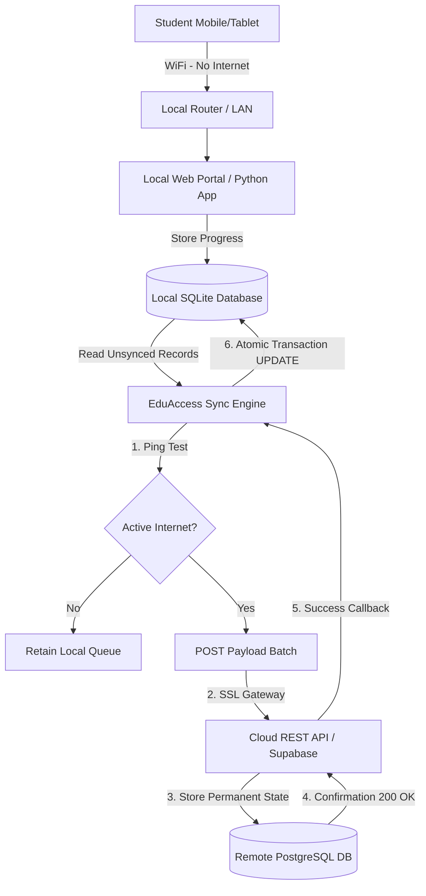

# 🎒 EduAccess-Core

### *An Offline-First Synchronization Engine for Democratic, Low-Bandwidth Digital Education*

---

## 🚀 The Context & The "Why"
In many developing regions, particularly across Nigeria and Sub-Saharan Africa, **unstable electricity networks and high mobile data costs** pose significant barriers to digital learning. Standard learning platforms (such as Coursera, Canvas, or edX) are built with the assumption of always-on, high-speed broadband. For a student study-session in a local community, constant streaming of video or interactive quizzes is financially and technically impossible.

**EduAccess-Core** is an open-source, lightweight, offline-first synchronization engine designed to bridge this digital divide. 

It acts as a locally-deployable server (capable of running on a cheap Raspberry Pi or a personal laptop) that serves educational contents locally over a Wi-Fi router **with zero internet data required**. The platform tracks student progress, quiz attempts, and completions locally in a lightweight, transaction-safe SQLite database, and queues these records to be automatically replicated to a central cloud database (hosted on Supabase/Railway) the moment network connectivity is established.

---

## 📊 Architectural Overview

The system operates on a dual-state replication model:
1. **Local Mode (Offline-First):** The student interacts with the local LAN portal. The local Python server records all progress in a local SQLite file.
2. **Replication Mode (Sync):** A background sync engine continually verifies WAN connectivity. When a connection is detected, it replicates unsynced records in an atomic batch transaction.



---

## 🛠️ Technical Features & Engineering Highlights

* **Resilient Connectivity Guard:** Utilizes low-timeout verification pings to check WAN availability without blocking local user interaction or crashing the application state during intermittent failures.
* **Atomic Replication Integrity:** Local records are only marked as synced (`synced = 1`) inside a strict database transaction *after* receiving a successful `200 OK` confirmation from the cloud gateway, preventing data duplication or loss.
* **Optimized Payload Serialization:** Packs unsynced telemetry (completion timestamps, module IDs, student credentials, and scoring) into standardized JSON arrays for efficient, batch transport.
* **Zero-Configuration Deployment:** Runs entirely on standard libraries (with the exception of `requests` for transport) to make deployment on resource-constrained hardware as painless as possible.

---

## ⚙️ Repository Structure
```
eduaccess-core/
├── sync_engine.py      # Core offline-first database controller and sync logic
├── requirements.txt    # Application dependencies
├── .gitignore          # Git exclusion rules
└── README.md           # Technical documentation and blueprint
```

---

## 🚀 Getting Started

### 📋 Prerequisites
- Python 3.8 or higher
- Pip (Python Package Installer)

### 🔧 Installation & Setup

1. **Clone the repository:**
   ```bash
   git clone https://github.com/kachiezibe/eduaccess-core.git
   cd eduaccess-core
   ```

2. **Install dependencies:**
   ```bash
   pip install -r requirements.txt
   ```

3. **Run the Synchronization Demonstration:**
   The sync engine includes a built-in sandbox simulation. To see the offline caching and synchronization replication protocol in action:
   ```bash
   python sync_engine.py
   ```

---

## 📝 Code Implementation (`sync_engine.py`)

Below is the complete implementation of the sync engine:

```python
import sqlite3
import requests
import json
import time
import logging

logging.basicConfig(level=logging.INFO, format='%(asctime)s - %(levelname)s - %(message)s')

class EduAccessSyncEngine:
    def __init__(self, local_db_path="eduaccess_local.db", remote_api_url="https://your-supabase-app.railway.app/api/sync"):
        self.local_db_path = local_db_path
        self.remote_api_url = remote_api_url
        self._initialize_local_database()

    def _initialize_local_database(self):
        """Initializes the local SQLite database for offline-first usage."""
        conn = sqlite3.connect(self.local_db_path)
        cursor = conn.cursor()
        
        # Table to store educational progress offline
        cursor.execute("""
            CREATE TABLE IF NOT EXISTS student_progress (
                id TEXT PRIMARY KEY,
                student_id TEXT NOT NULL,
                course_id TEXT NOT NULL,
                module_completed TEXT NOT NULL,
                score INTEGER,
                completed_at TIMESTAMP DEFAULT CURRENT_TIMESTAMP,
                synced INTEGER DEFAULT 0
            )
        """)
        conn.commit()
        conn.close()

    def record_progress_offline(self, progress_id, student_id, course_id, module, score):
        """Records a student's completion state locally while completely offline."""
        try:
            conn = sqlite3.connect(self.local_db_path)
            cursor = conn.cursor()
            cursor.execute(
                "INSERT INTO student_progress (id, student_id, course_id, module_completed, score, synced) VALUES (?, ?, ?, ?, ?, 0)",
                (progress_id, student_id, course_id, module, score)
            )
            conn.commit()
            logging.info(f"Offline entry stored successfully for Student {student_id} (Module: {module})")
        except sqlite3.IntegrityError:
            logging.warning(f"Record {progress_id} already exists locally.")
        except Exception as e:
            logging.error(f"Failed to record progress: {e}")
        finally:
            conn.close()

    def check_network_connectivity(self):
        """Pings a reliable server to check if an active internet connection is present."""
        try:
            # 2-second timeout to avoid blocking execution
            requests.get("https://www.google.com", timeout=2)
            return True
        except requests.ConnectionError:
            return False

    def sync_local_data_to_cloud(self):
        """Extracts unsynced progress data, attempts transmission, and marks as synced upon confirmation."""
        if not self.check_network_connectivity():
            logging.warning("Offline sync initiated: No active internet connection detected. Retaining local queue.")
            return False

        logging.info("Active internet connection detected. Initiating data replication...")
        
        conn = sqlite3.connect(self.local_db_path)
        cursor = conn.cursor()
        
        # Retrieve all unsynced records
        cursor.execute("SELECT id, student_id, course_id, module_completed, score, completed_at FROM student_progress WHERE synced = 0")
        unsynced_records = cursor.fetchall()
        
        if not unsynced_records:
            logging.info("Data replication complete: All local records are already in sync with the cloud.")
            conn.close()
            return True

        # Construct payload
        payload = []
        for rec in unsynced_records:
            payload.append({
                "id": rec[0],
                "student_id": rec[1],
                "course_id": rec[2],
                "module_completed": rec[3],
                "score": rec[4],
                "completed_at": rec[5]
            })

        # Transmit to cloud database (hosted on Railway/Supabase)
        try:
            headers = {'Content-Type': 'application/json'}
            response = requests.post(self.remote_api_url, data=json.dumps(payload), headers=headers, timeout=10)
            
            if response.status_code == 200:
                # Mark as synced inside transaction to ensure atomic consistency
                cursor.execute("UPDATE student_progress SET synced = 1 WHERE synced = 0")
                conn.commit()
                logging.info(f"Successfully replicated {len(payload)} records to the cloud database!")
                sync_successful = True
            else:
                logging.error(f"Cloud replication rejected by gateway. HTTP Status Code: {response.status_code}")
                sync_successful = False
        except Exception as e:
            logging.error(f"Replication failed due to transport error: {e}")
            sync_successful = False
        finally:
            conn.close()
            
        return sync_successful

# --- Sandbox Demonstration ---
if __name__ == "__main__":
    # Instantiate the sync engine
    engine = EduAccessSyncEngine()
    
    # Simulate a student completing modules while sitting at a cyber cafe with no network
    engine.record_progress_offline("TXN-001", "KACHI-01", "CS-50X", "Algorithmic Complexity", 95)
    engine.record_progress_offline("TXN-002", "KACHI-01", "CS-50X", "C Binary Search Trees", 88)
    
    # Simulate syncing when network becomes active
    engine.sync_local_data_to_cloud()
```

---

## 🛡️ License
Distributed under the MIT License. See `LICENSE` for more information.

---

## 💡 Real-World Impact
This engine serves as the technical backbone of Kachi Ezibe's **EduAccess** initiative, a project aimed at distributing offline-capable educational servers loaded with open-source curriculum materials to schools, cyber cafés, and study groups in Nigeria, helping students learn without boundaries.
